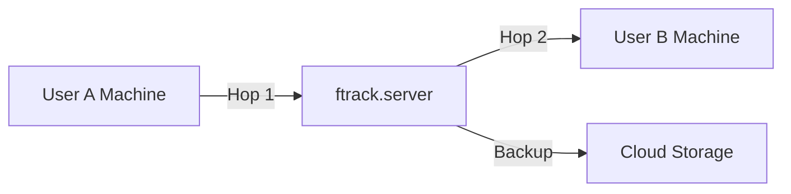

# Low-Touch Improvements

Quick wins that improve user experience, maintainability, or reliability with minimal code changes.

---

## 🎯 Quick Wins (< 30 minutes each)

### 1. Add Default Destination Selection

**Current**: Destination dropdown is empty by default  
**Improvement**: Default to `ftrack.server` as destination  
**Why**: Most common workflow is local → cloud backup

**Change**:
```python
# sync_action.py line 178
self.get_locations_menu(
    'dest_location',
    label='Destination',
    default_value='ftrack.server'  # ADD THIS
)
```

**Impact**: One less click for most common operation

---

### 2. Prevent Same Source/Destination

**Current**: User can select same location for both source and dest  
**Improvement**: Validate and show error message  
**Why**: Syncing to same location is meaningless, confuses users

**Change**:
```python
# sync_action.py build_sync_event() around line 140
if source_location == dest_location:
    raise ValueError(
        'Source and destination cannot be the same location'
    )
```

**Impact**: Prevents user mistakes, clearer error

---

### 3. Show Component Count in UI

**Current**: User sees "Sync Tool" generic title  
**Improvement**: Show "Sync Tool - 25 components selected"  
**Why**: User knows what they're about to sync

**Change**:
```python
# sync_action.py get_locations_ui() around line 150
selection = event.get('data', {}).get('selection', [])
component_count = len(selection)
menu['title'] = f'Sync Tool - {component_count} asset version(s) selected'
```

**Impact**: Better user feedback before action

---

### 4. Add "Sync Here" Quick Action

**Current**: User must select source and destination  
**Improvement**: Add button "Sync to My Machine (from ftrack.server)"  
**Why**: Common workflow: restore/pull from cloud

**Change**:
```python
# sync_action.py get_locations_ui()
menu['items'].append({
    'value': 'Quick Actions',
    'type': 'label'
})
menu['items'].append({
    'label': '⬇️ Sync to My Machine (from ftrack.server)',
    'name': 'quick_sync_here',
    'type': 'button'
})
```

**Impact**: One-click restore from cloud

---

### 5. Show Location Online Status

**Current**: All locations shown, no indication if accessible  
**Improvement**: Mark locations with ✅ (accessible) or 💤 (offline)  
**Why**: User knows if remote machine is available

**Change**:
```python
# sync_action.py get_locations_menu() around line 111
for location in locations:
    status = '✅' if location.accessor else '💤'
    item = {
        'label': f'{status} {location["name"]}',
        'value': location['name']
    }
```

**Impact**: Visual feedback on location availability

---

### 6. Add Keyboard Shortcuts to README

**Current**: No keyboard shortcuts documented  
**Improvement**: Add section to README  
**Why**: Power users want efficiency

**Change**: Add to README.md:
```markdown
## Keyboard Shortcuts

- `Ctrl+Space` - Open action menu
- Type "sync" - Quick filter to sync tool
- `Enter` - Launch action
- `Tab` - Navigate between source/destination
- `Enter` - Submit sync
```

**Impact**: Better documentation, faster workflows

---

## 🔧 Developer Experience (< 1 hour each)

### 7. Add Type Hints

**Current**: No type hints anywhere  
**Improvement**: Add to function signatures  
**Why**: Better IDE support, catches bugs early

**Change**:
```python
# Example for sync.py
def on_sync_to_destination(
    session: ftrack_api.Session,
    source_id: str,
    dest_id: str,
    components: list[dict],
    requesting_user_id: str
) -> None:
```

**Estimate**: 2-3 hours for all public functions  
**Impact**: Better tooling, clearer contracts

---

### 8. Add .editorconfig

**Current**: Inconsistent formatting possible  
**Improvement**: Add .editorconfig file  
**Why**: Ensures consistent style across contributors

**Change**: Create `.editorconfig`:
```ini
root = true

[*]
charset = utf-8
end_of_line = lf
insert_final_newline = true
trim_trailing_whitespace = true

[*.py]
indent_style = space
indent_size = 4
max_line_length = 100

[*.md]
trim_trailing_whitespace = false
```

**Impact**: Automatic formatting in most IDEs

---

### 9. Add pre-commit Hooks

**Current**: No automated checks  
**Improvement**: Add pre-commit config with black, flake8  
**Why**: Catches issues before commit

**Change**: Create `.pre-commit-config.yaml`:
```yaml
repos:
  - repo: https://github.com/psf/black
    rev: 23.12.1
    hooks:
      - id: black
  - repo: https://github.com/pycqa/flake8
    rev: 7.0.0
    hooks:
      - id: flake8
        args: ['--max-line-length=100']
```

**Impact**: Consistent code quality

---

## 🚀 Performance (< 2 hours each)

### 10. Cache Location Queries

**Current**: `get_locations()` queries every time  
**Improvement**: Cache locations for action lifetime  
**Why**: Reduces database queries

**Change**:
```python
# sync_action.py __init__
self._locations_cache = None

def get_locations(self, name=False):
    if self._locations_cache is None:
        self._locations_cache = self.session.query('select name from Location').all()
    
    locations = self._locations_cache
    if name:
        locations = [x['name'] for x in locations]
    return locations
```

**Impact**: Faster UI rendering

---

### 11. Add Progress Percentage to Job Description

**Current**: Job says "Syncing..." no percentage  
**Improvement**: Update every 10 components with percentage  
**Why**: User sees actual progress

**Change**:
```python
# sync.py around every 10 components
if i % 10 == 0:
    percentage = (i / total) * 100
    job['data'] = json.dumps({
        'description': f'Syncing {i}/{total} components ({percentage:.1f}%)'
    })
```

**Impact**: Better user feedback on long operations

---

### 12. Add Estimated Time Remaining

**Current**: No ETA shown  
**Improvement**: Calculate and show ETA in Job  
**Why**: User knows how long to wait

**Change**:
```python
# sync.py track timing
if i > 10:  # After 10 samples
    elapsed = time.time() - start_time
    rate = i / elapsed  # components per second
    remaining = (total - i) / rate  # seconds
    eta_str = _format_duration(remaining)
    job['data'] = json.dumps({
        'description': f'Syncing {i}/{total} - ETA: {eta_str}'
    })
```

**Impact**: Better user expectations

---

## 🛡️ Reliability (< 1 hour each)

### 13. Add Component Size Validation

**Current**: No size limit check  
**Improvement**: Warn on very large components  
**Why**: Prevents timeouts, manages expectations

**Change**:
```python
# sync.py before transfer
component_size = component.get('size', 0)
if component_size > 10 * 1024**3:  # 10GB
    logger.warning(
        f"Large component detected [name={component_name}, "
        f"size={_format_size(component_size)}] - sync may take a while"
    )
```

**Impact**: User awareness of long operations

---

### 14. Add Disk Space Check

**Current**: No disk space validation  
**Improvement**: Check before starting sync  
**Why**: Prevents failures mid-sync

**Change**:
```python
# sync.py at start
import shutil
total_size = sum(c.get('size', 0) for c in components)
free = shutil.disk_usage(destination.accessor.prefix).free
if total_size > free * 0.9:  # Use max 90% of free
    raise IOError(
        f'Insufficient disk space: need {_format_size(total_size)}, '
        f'available {_format_size(free)}'
    )
```

**Impact**: Fail fast with clear message

---

### 15. Add Retry Count to Logs

**Current**: No indication how many retries occurred  
**Improvement**: Log retry attempts  
**Why**: Helps diagnose flaky network issues

**Change**:
```python
# sync.py in retry logic
for attempt in range(3):
    try:
        location.add_component(component, source)
        if attempt > 0:
            logger.info(f"Succeeded after {attempt+1} attempts")
        break
    except Exception as e:
        if attempt < 2:
            logger.warning(f"Attempt {attempt+1}/3 failed: {e}, retrying...")
```

**Impact**: Better debugging information

---

## 📊 Observability (< 30 minutes each)

### 16. Add Metrics to Sync Report

**Current**: Report shows component lists  
**Improvement**: Add summary metrics at top  
**Why**: Quick glance at key numbers

**Change**:
```python
# sync_report.py add to report
## 📊 Quick Stats

| Metric | Value |
|--------|-------|
| Success Rate | {success_rate:.1f}% |
| Total Data | {_format_size(total_size)} |
| Average Speed | {_format_size(avg_speed)}/s |
| Fastest Component | {fastest_component} ({fastest_time:.1f}s) |
| Slowest Component | {slowest_component} ({slowest_time:.1f}s) |
```

**Impact**: Better insights into sync performance

---

### 17. Add Health Check Endpoint

**Current**: No way to check plugin status  
**Improvement**: Add action that reports status  
**Why**: Useful for monitoring/troubleshooting

**Change**: Add new action:
```python
class HealthCheckAction(BaseAction):
    identifier = 'ftrack.user-location.health'
    label = 'Health Check'
    
    def launch(self, event):
        location = self.session.pick_location()
        return {
            'success': True,
            'message': (
                f'✅ User location healthy\n'
                f'Location: {location["name"]}\n'
                f'Accessor: {type(location.accessor).__name__}\n'
                f'Path: {location.accessor.prefix}\n'
                f'Disk Free: {_get_free_space(location.accessor.prefix)}'
            )
        }
```

**Impact**: Quick status check

---

### 18. Log ftrack API Version

**Current**: No version info in logs  
**Improvement**: Log at startup  
**Why**: Helps diagnose compatibility issues

**Change**:
```python
# user_location.py register()
import ftrack_api
logger.info(
    f'[register] User location plugin initializing '
    f'[plugin_version={__version__}, ftrack_api={ftrack_api.__version__}]'
)
```

**Impact**: Better troubleshooting context

---

## 🎨 User Experience (< 1 hour each)

### 19. Add Confirmation for Large Syncs

**Current**: No confirmation prompt  
**Improvement**: Confirm if >100 components  
**Why**: Prevents accidental large operations

**Change**:
```python
# sync_action.py launch()
if len(selection) > 100:
    return {
        'type': 'form',
        'items': [{
            'value': f'⚠️ You are about to sync {len(selection)} components. Continue?',
            'type': 'label'
        }, {
            'label': 'Yes, proceed',
            'name': 'confirm',
            'type': 'boolean'
        }]
    }
```

**Impact**: Prevents mistakes

---

### 20. Add Sync History to UI

**Current**: No history of previous syncs  
**Improvement**: Show last 5 syncs in action menu  
**Why**: Quick access to recent operations

**Change**:
```python
# Store in user metadata
# Show in get_locations_ui()
menu['items'].append({
    'value': '📜 Recent Syncs',
    'type': 'label'
})
# Add last 5 syncs as labels
```

**Impact**: Better visibility into sync activity

---

## 🔐 Security (< 30 minutes each)

### 21. Sanitize Location Names in Logs

**Current**: Full email addresses in logs  
**Improvement**: Redact domain in public logs  
**Why**: Privacy protection

**Change**:
```python
def _sanitize_location_name(name):
    """lorenzo.angeli@backlight.co.BL4006 → lorenzo.a...@b....co.BL4006"""
    if '@' in name:
        user, rest = name.split('@', 1)
        user = user[:8] + '...' if len(user) > 8 else user
        domain = rest.split('.')[0][:1] + '...'
        return f'{user}@{domain}'
    return name
```

**Impact**: Better privacy in shared logs

---

### 22. Add Rate Limiting

**Current**: No throttling on sync requests  
**Improvement**: Limit to 1 sync per location per 5s  
**Why**: Prevents accidental spam

**Change**:
```python
# sync_action.py
self._last_sync_time = {}

def launch(self, event):
    location_name = self.location['name']
    last = self._last_sync_time.get(location_name, 0)
    if time.time() - last < 5:
        return {
            'success': False,
            'message': 'Please wait 5 seconds between syncs'
        }
    self._last_sync_time[location_name] = time.time()
```

**Impact**: Prevents accidental double-clicks

---

## 📝 Documentation (< 30 minutes each)

### 23. Add Troubleshooting FAQ to README

**Current**: No FAQ section  
**Improvement**: Add common issues and solutions  
**Why**: Reduces support burden

**Change**: Add to README.md:
```markdown
## Troubleshooting

### Action doesn't appear in ftrack
- Ensure ftrack Connect is running
- Check plugin installed in correct directory
- Restart ftrack Connect

### Sync fails with "Location not accessible"
- Ensure source machine has ftrack Connect running
- Check location shown in action menu matches machine

### Components not arriving at destination
- Check both users' Jobs in ftrack UI
- Verify ftrack.server has components (Hop 1)
- Ensure destination machine Connect running (Hop 2)
```

**Impact**: Self-service troubleshooting

---

### 24. Add Architecture Diagram to README

**Current**: Text-only architecture description  
**Improvement**: Add ASCII/mermaid diagram  
**Why**: Visual learners understand better

**Change**: Add to README.md:
```markdown
## Architecture



**Impact**: Clearer understanding

---

### 25. Add Changelog

**Current**: No change tracking  
**Improvement**: Add CHANGELOG.md  
**Why**: Users know what changed between versions

**Change**: Create `CHANGELOG.md`:
```markdown
# Changelog

## [0.3.7] - 2026-06-10

### Fixed
- Allow ftrack.server as source location
- Fix entity_type KeyError in availability checking
- Remove early location access causing session error

### Changed
- Migrated to AdvancedBaseAction for cleaner code
```

**Impact**: Transparent version history

---

## Summary

**Quick Wins (30 min each)**: 6 improvements  
**Developer Experience (1 hour each)**: 3 improvements  
**Performance (2 hours each)**: 3 improvements  
**Reliability (1 hour each)**: 3 improvements  
**Observability (30 min each)**: 3 improvements  
**User Experience (1 hour each)**: 2 improvements  
**Security (30 min each)**: 2 improvements  
**Documentation (30 min each)**: 3 improvements

**Total: 25 low-touch improvements**

**Time Investment by Category**:
- Quick Wins: ~3 hours
- Developer Experience: ~3 hours
- Performance: ~6 hours
- Reliability: ~3 hours
- Observability: ~1.5 hours
- User Experience: ~2 hours
- Security: ~1 hour
- Documentation: ~1.5 hours

**Grand Total**: ~21 hours of work for significant quality improvements

## Prioritization

**Highest Value / Lowest Effort** (Do These First):
1. ✅ #2 - Prevent Same Source/Destination (prevents user errors)
2. ✅ #1 - Default Destination Selection (saves clicks)
3. ✅ #5 - Show Location Online Status (visual feedback)
4. ✅ #13 - Component Size Validation (prevents surprises)
5. ✅ #18 - Log API Version (better debugging)
6. ✅ #23 - Add FAQ to README (reduces support)

**Medium Value / Medium Effort** (Do Next):
7. #11 - Progress Percentage (better UX)
8. #14 - Disk Space Check (prevents failures)
9. #19 - Large Sync Confirmation (prevents mistakes)
10. #8 - Add .editorconfig (better DX)

**Lower Priority** (Nice to Have):
11-25: Remaining improvements
